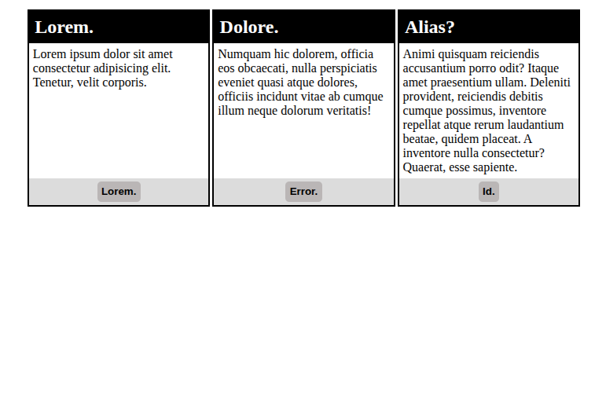

# problem-statement

build a 3 cards using flexbox with

- heading
- below it a paragraph
- below it a button .

para content should be of different hight and button shuould align at bottom .

## view

