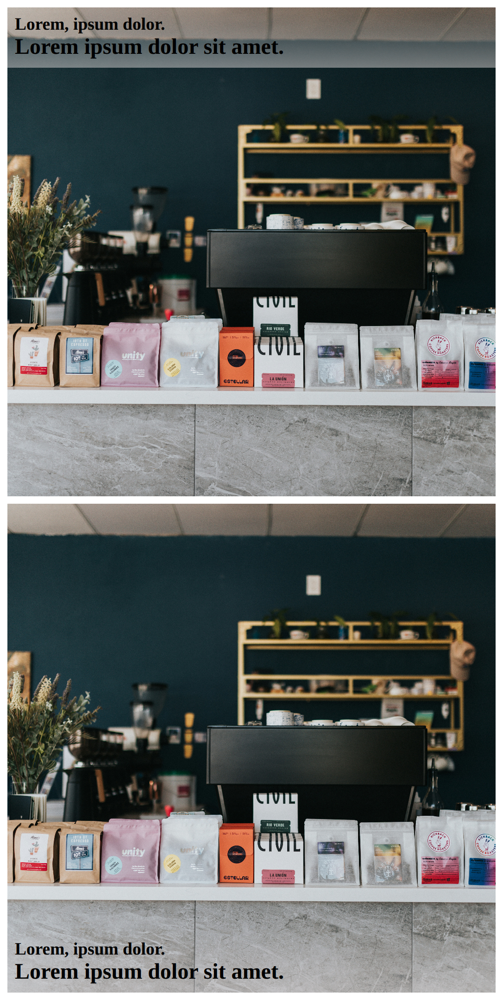
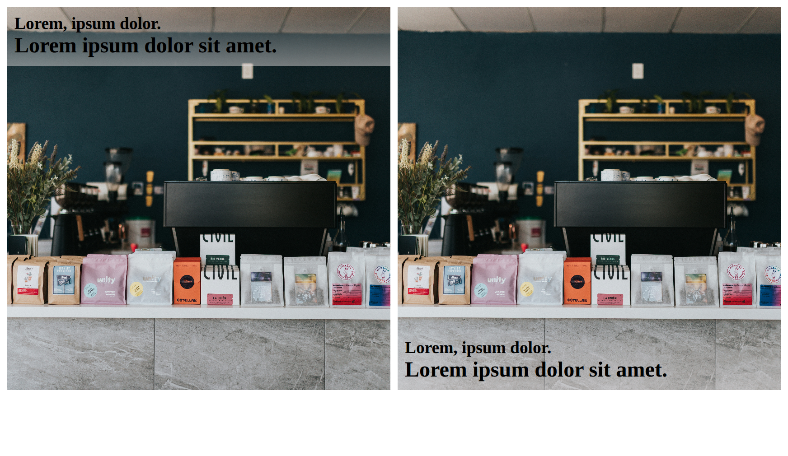

# image with headers using grid

- use `grid` to create texts with `background-image`
- use `aspect-ratio` prop to make card size perfect square
- use `align-content` to palce content on start or end to inner `grid` items of `card` grid.
- use `liner-gradient()` function to create semi-transparent fade so that headers are clearly visible.

## view

### mobile

### desktop

