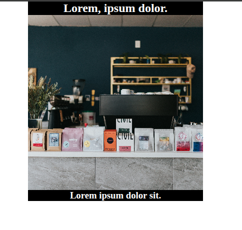
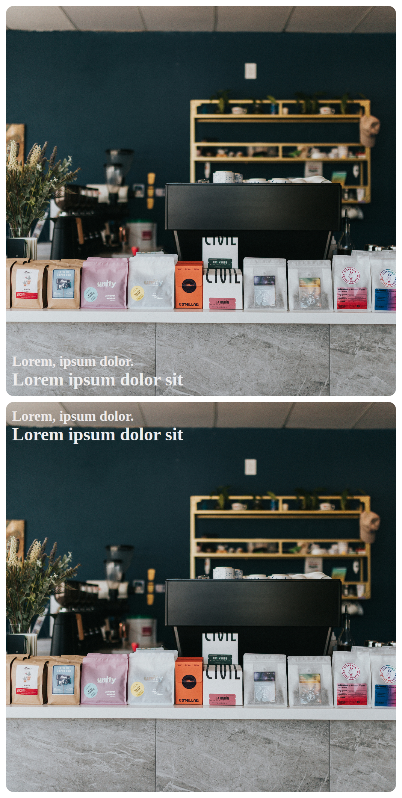
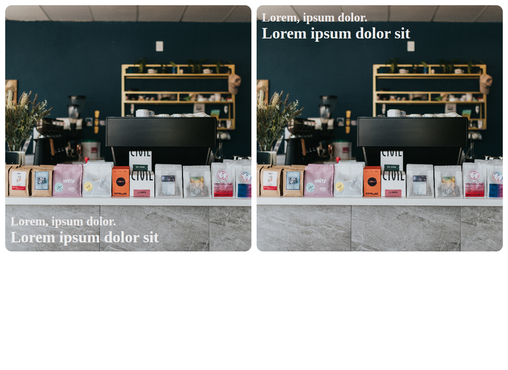
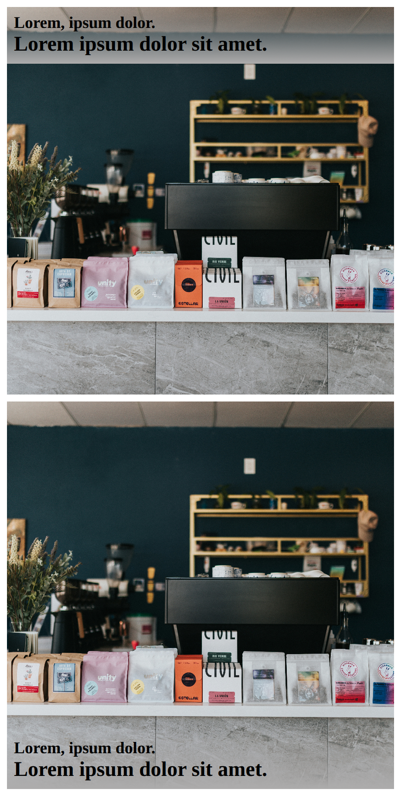
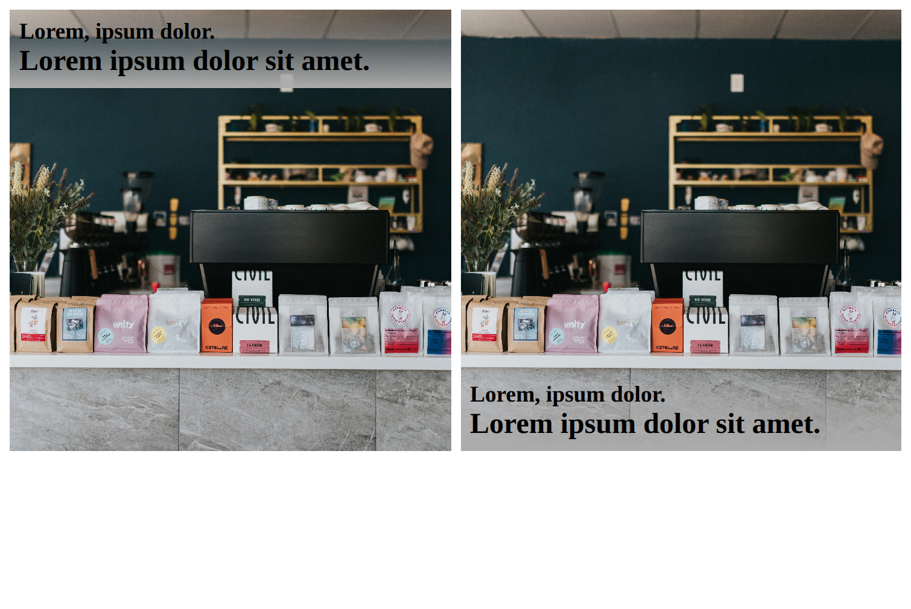

# problem statement

image with header and subheader at the top and bottom within image.

## case-1

[image with header above and subheader below](./1-image-with-text/README.md)

### view

### problem

- header and subheader are not part of image. header is above it and subheader is below the image.

## solution-1

### using postion property to set position of header and subheaer as a group with in image card

[image with header and subheader inside image at its top or bottom](./2-image-with-text/README.md)

#### views

##### mobile

#### desktop

## solution- 2

### using image as background image inside flex items

#### solution-2 views

##### mobile view

##### desktop view

## solution-3

### using nested grids

- outer grid to organise cards in a grid
- inner gird to place text-haders at start or end.

#### solution-3 views

##### solution-3 mobile view

##### solution-3 desktop view

