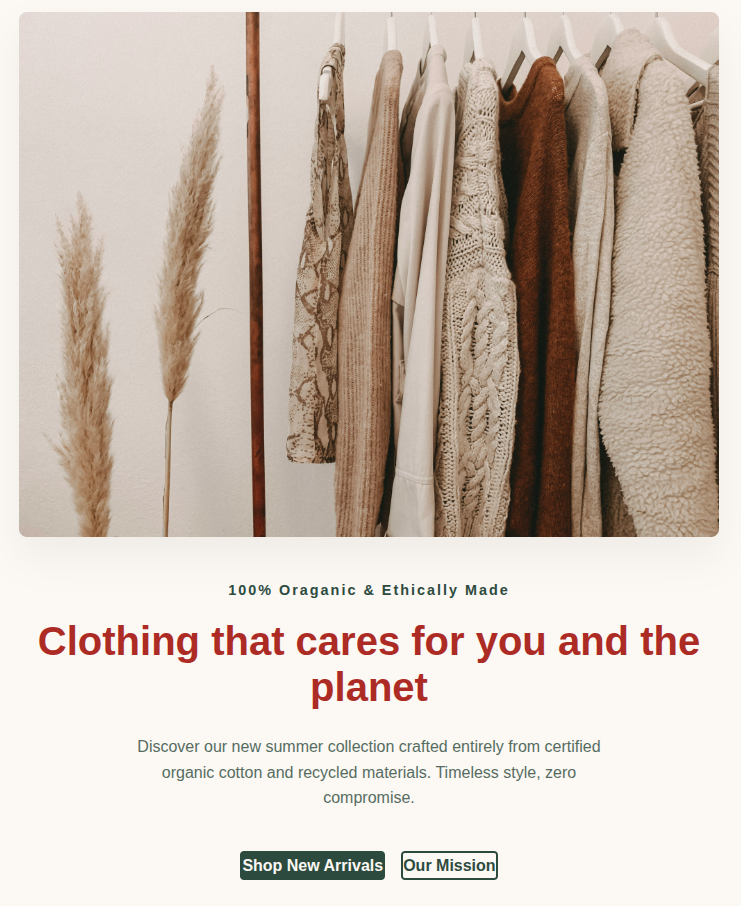
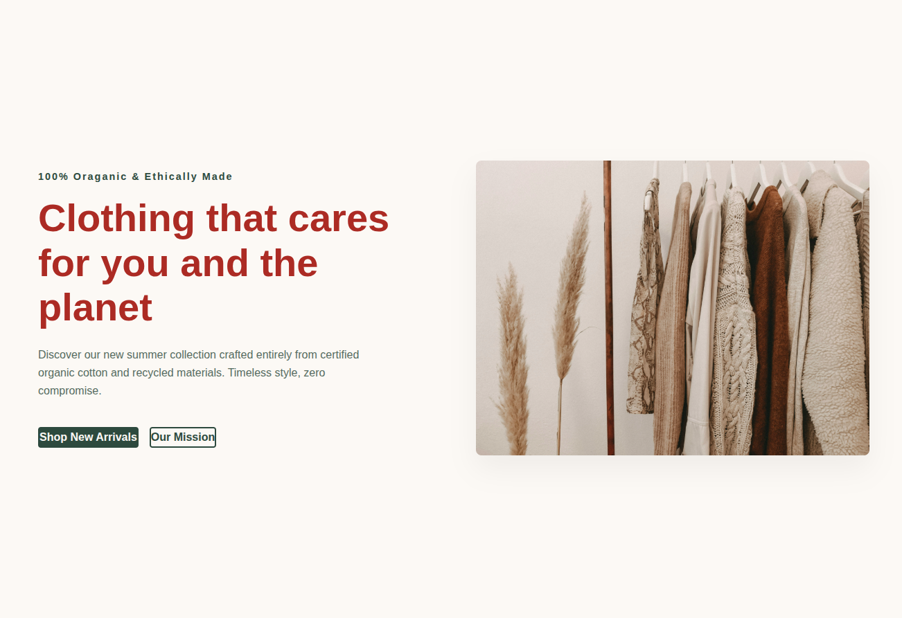

# hero section of sustainable clothing brand

We will use a **split-screen layout:** text and a call-to-action button on the left, and a beautiful placeholder image on the right. This layout is standard in e-commerce because it instantly tells a visual story while keeping the focus on your products.

## mobile view

## desktop view

------------------------------

## 💡 Core CSS Concepts

* **CSS Custom Properties (`--variable-name`):** Used at the top under `:root`. This keeps your colors uniform. If you want a blue theme instead of green later, you only have to change it in one spot!
* **Flexbox (`display: flex`):** Used on `.hero-container` to seamlessly align columns side-by-side on desktop, and flipped to a single vertical stack on mobile using `flex-direction: column-reverse`.
* **Image Management (`object-fit: cover`):** This is a lifesaver in web design. It tells the browser to crop and scale the image gracefully into its box container without distorting its proportions.
