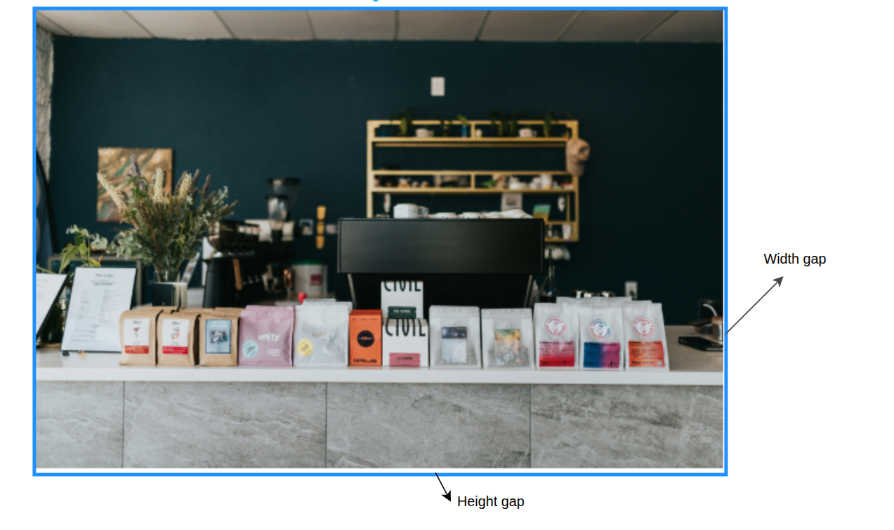

# img insie a div contaienr

## issues

### Image Overflowing Container:

`max-width: 100%` and `height: auto`. This forces the image to scale down proportionally to fit the parent width.

### gaps



### Width gap / Sub-pixel Rendering Variance

Caused by **browser sub-pixel rendering**. High-resolution screens use decimal math to map CSS pixels to physical hardware pixels, resulting in tiny rounding variations.

### Bottom Gap

Caused by the **`vertical-align`** property. Images are `inline` by default and sit on the `text baseline`, leaving extra space below for text descenders (like the tails on g, p, y).

## The Fix

Adding `display: block` to your image strips away its text-like alignment rules, removes the bottom gap completely, and perfectly matches the container height:

```css
img {
  max-width: 100%;
  height: auto;
  display: block; /* Removes the bottom space and fixes layout */
}
```
